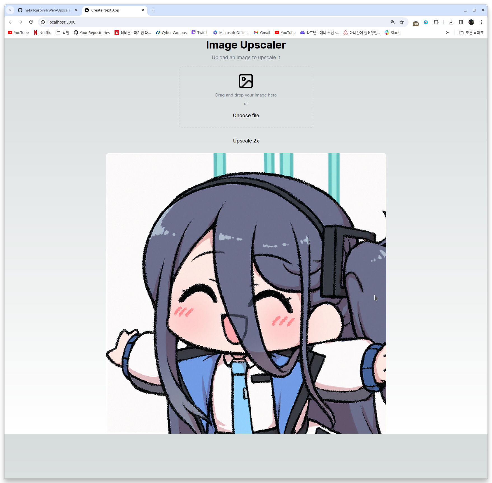

# ONNX Web Upscaler x2

This is a [Next.js](https://nextjs.org/) project bootstrapped with [`create-next-app`](https://github.com/vercel/next.js/tree/canary/packages/create-next-app).

### Web Design :

AI Generation with [v0.dev](https://v0.dev/)

### Upscale model :

Xenova/swin2SR-classical-sr-x2-64 : [huggingface_repo](https://huggingface.co/Xenova/swin2SR-classical-sr-x2-64)

also can be used :

Xenova/swin2SR-classical-sr-x4-64 : [huggingface_repo](https://huggingface.co/Xenova/swin2SR-classical-sr-x4-64)

Xenova/swin2SR-lightweight-x2-64 : [huggingface_repo](https://huggingface.co/Xenova/swin2SR-lightweight-x2-64)

Xenova/swin2SR-compressed-sr-x4-48 : [huggingface_repo](https://huggingface.co/Xenova/swin2SR-compressed-sr-x4-48)

Xenova/swin2SR-realworld-sr-x4-64-bsrgan-psnr : [huggingface_repo](https://huggingface.co/Xenova/swin2SR-realworld-sr-x4-64-bsrgan-psnr)

## Result Page



## Getting Started

install dependencies:

```bash
npm i 
```
run the development server :

```bash
npm run dev
```

Open [http://localhost:3000](http://localhost:3000) with your browser to see the result.

build command :
```bash
npm run build
```

test launch :
```bash
npm run start
```